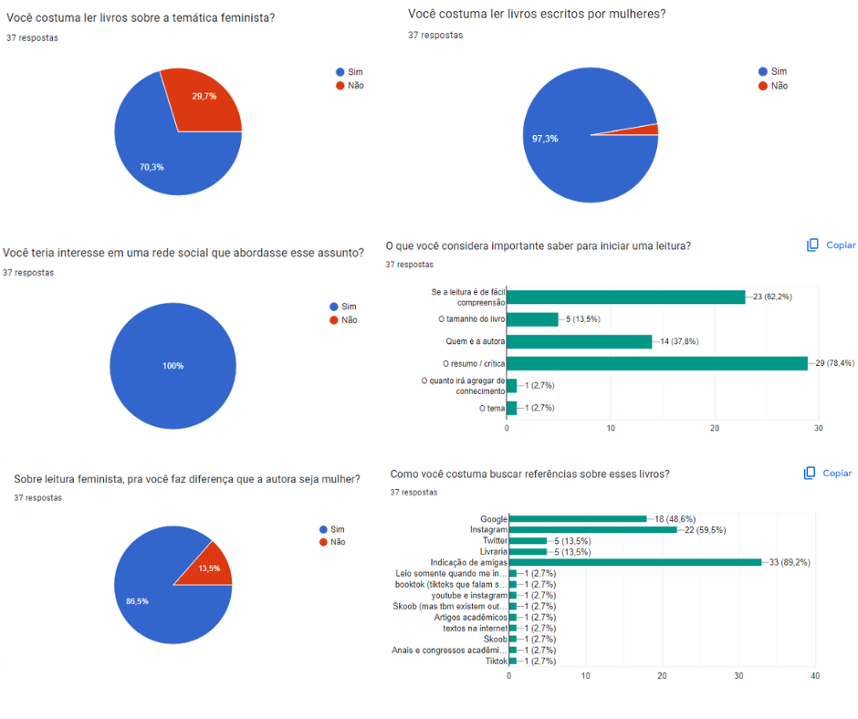
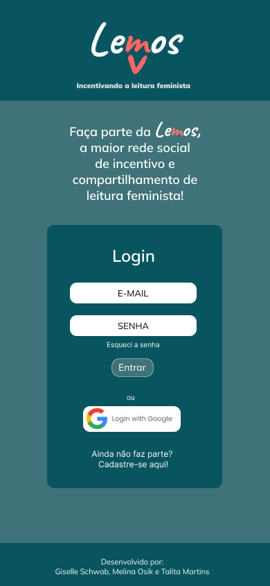
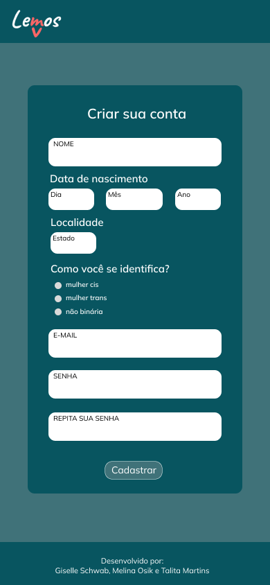
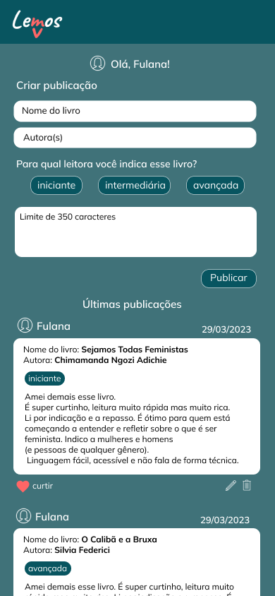

# Criando uma Rede Social

## Índice

* [1. Resumo do projeto](#1-resumo-do-projeto)
* [2. Histórias de usuário](#2-historias-de-usuario)
* [3. Protótipos](#3-prototipos)
* [4. Testes](#4-testes)
* [5. Objetivos alcançados](#5-objetivos-alcancados)
* [6. Ferramentas utilizadas](#6-ferramentas-utilizadas)
* [7. Desenvolvedoras](#7-desenvolvedoras)

***

## 1. Resumo do projeto

Este projeto é uma rede social voltada para mulheres que gostariam de trocar informações sobre livros com a temática feminista. O objetivo é que as usuárias possam postar breves opiniões pessoais, a fim de compartilhar suas leituras, novas autoras e colaborar com o direcionamento de leitoras iniciantes.

## 2. Histórias de usuário

Para entender melhor as necessidades do usuário, foi criado um questionário e enviado para um número considerável de pessoas que se encaixam no público alvo do projeto. 

* [Forms](https://docs.google.com/forms/d/1COMhEm6fq0R220bUlIyGbzvqqAYgm5k8eY-bYp8sGnI/edit)

A partir dos dados coletados, foram definidas seis histórias de usuário:

### 2.1 História de usuário 01

Eu, como interessada na rede, gostaria de realizar meu cadastro autenticado.

### 2.2 História de usuário 02

Eu, enquanto membro da rede social, gostaria de fazer meu login de forma prática - usuário e senha / google.

### 2.3 História de usuário 03

Eu, como interessada no tema, porém com pouco repertório, gostaria de saber por onde começar as leituras.

### 2.4 História de usuário 04

Pra mim, enquanto amadora no tema, é importante saber se a leitura é de fácil compreensão.

### 2.5 História de usuário 05

Eu, como leitora, acho importante saber quem é a autora.

### 2.6 História de usuário 06

Eu, que já possuo conhecimento no assunto, gostaria de compartilhar meu ponto de vista num local onde haja interesse.

## 3. Protótipos

### 3.1 Protótipo de baixa fidelidade

----> INSERIR IMAGEM

### 3.2 Protótipo de alta fidelidade

Para o protótipo de alta fidelidade foi utilizada a plataforma Figma.

 1 - Tela de Login 

2 - Tela de cadastro 

3 - Feed 

## 4. Testes

### 4.1 Testes unitários

### 4.2 Testes de usabilidade

## 5. Objetivos alcançados
  - Usar VanillaJS
  - Ser uma SPA.
  - Ser _responsivo_.
  - Uso de Git e GitHub colaborativo;
  - Receber _code review_ de pelo menos uma parceira de outra equipe.
  - Fazer _tests_ unitários.
  - Testes unitários cobrem um mínimo de 70% de statements, functions, lines e branches
  - Fazer testes manuais buscando erros e imperfeições simples.
  - Utilização do Firebase para autenticação e uso do firestore.
  - Fazer testes de usabilidade e incorporar o _feedback_ dos usuários como melhorias.
  - Fazer deploy do aplicativo e marcar a versão (git tag).

## 6. Ferramentas utilizadas

   
          
## 7. Desenvolvedoras
Giselle Schwab Silva [Linkedin](https://www.linkedin.com/in/giselle-schwab-silva-58930610a/)
&nbsp;
[GitHub](https://github.com/giselleschwab)

Melina Osik  [Linkedin](https://www.linkedin.com/in/melina-osik/)
&nbsp;
[GitHub](https://github.com/osikmelina)

Talita Martins [Linkedin](https://www.linkedin.com/in/talitamsx/)
&nbsp;
[GitHub](https://github.com/talitamsx)
